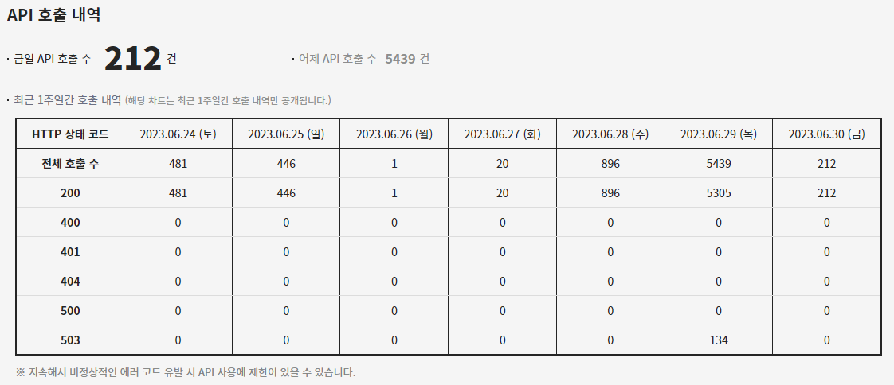
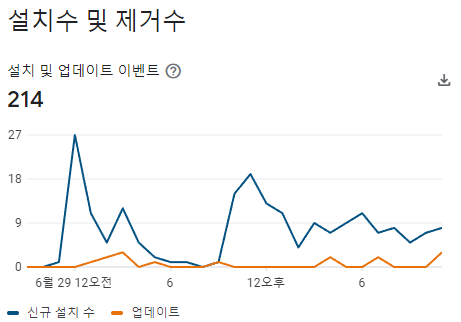
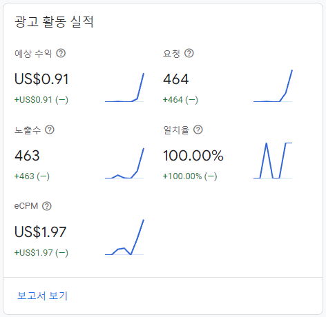
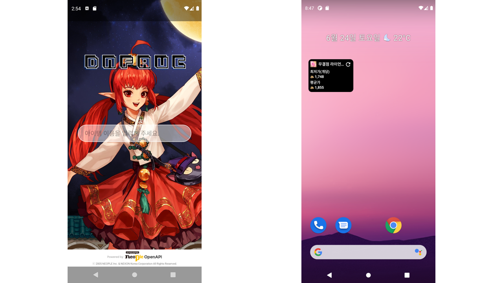
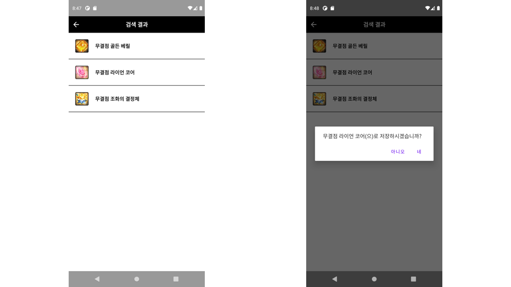

# 던전앤파이터 경매장 최저가 위젯 ‘던옥’

날짜: 2023년 6월 21일
태그: 개인 프로젝트

### 2023년 06월 21일 ~ 2023년 06월 25일 (2023년 06월 28일 1.0 릴리즈)

# 💻 프로젝트 소개

---

## `던옥` 이란?

- 네오플에서 서비스중인 게임 ‘던전앤파이터’의 Open Api를 활용하여 제작된 안드로이드 네이티브 어플리케이션입니다. 던전앤파이터 인게임 재화의 경우 가격 변동폭이 잦고, 또한 그 폭이 적지 않습니다. 때문에 현재 게임에 접속중이 아니더라도 실시간으로 이를 확인케 하고자 `던옥` 이라는 어플리케이션을 제작하게 되었습니다.
- `던옥`에서는 사용자가 직접 설정한 재화나 아이템의 최저가와 평균가를 위젯을 통해 실시간으로 확인할 수 있습니다.

# ⭐ 평가 및 일일 사용자

---

- 해당 프로젝트는 2023년 06월 29일 던전앤파이터 공식 홈페이지 “오늘의 던파”에 소개되었습니다.
- 공식 홈페이지 게시물 링크 : [액션쾌감!!! 던전앤파이터 - 아이템 경매장 최저가/평균가 확인 위젯 '던옥'](https://df.nexon.com/df/community/dnfboard?title_type=3&view_type=all&mode=view&no=2818761&job=99&grow_type=0)

- 출시 직후, 던전앤파이터 관련 커뮤니티의 폭발적인 반응을 얻으며 6월 28일 등록된 게시물 중 추천수 1위를 달성하였습니다.

- 출시 첫 날인 2023년 06월 28일, 896건의 api 호출이 발생하였습니다.
- “오늘의 던파”에 소개된 2023년 06월 29일, 5439건의 api 호출로 마무리 지었습니다. (에러코드 503은 게임 점검 중 호출된 api)

- 첫째 날, 둘째 날 합하여 설치는 214건을 달성하였습니다.
- 메인 액티비티 하단 배너의 광고 노출은 463건 발생하였습니다.

# ▶️ Google Play

---

[던옥 - Apps on Google Play](https://play.google.com/store/apps/details?id=com.shin.dnfauctionwidget)

# 🐙 Github

---

[GitHub - shin1488/DNFAuctionWidget](https://github.com/shin1488/DNFAuctionWidget)

# 📝 주요 기능

---

## 메인 액티비티

- 화면 중단에 위치한 Edittext를 통하여 아이템 이름을 입력하고, 검색할 수 있습니다.

## 검색 결과 액티비티

- 메인 액티비티에서 검색한 문자열을 바탕으로 api요청을 하여, 해당 문자열을 포함한 아이템들의 리스트를 RecyclerView를 통해 볼 수 있습니다.
- 각 RecyclerView는 아이템의 이미지와 아이템의 이름으로 구성되어, 어떤 아이템이 표시되고 있는지 직관적으로 알 수 있게 구성되어 있습니다.
- 원하는 아이템이 리스트에 있다면, 클릭하여 해당 아이템의 정보를 로컬 저장소에 저장합니다. 그 후, 위젯에서 해당 정보를 불러 와 api 요청을 하여 위젯의 정보를 갱신합니다.

## 던옥 위젯

- 던옥 위젯을 통해 검색 결과 액티비티에서 설정하였던 아이템의 이미지, 이름을 위젯 상단에서 확인할 수 있습니다.
- 우상단의 새로고침 버튼을 통하여 현재 경매장에 등록된 아이템의 최저가와 평균가를 갱신할 수 있습니다.
- 위젯의 하단에서 사용자가 설정한 아이템의 경매장 최저가와 평균가를 확인할 수 있습니다.

# 🛠 사용된 기술

---

- Android / Java
- Glide
- Google AdMob
- Volley

# ✨ 배운 점

---

## 위젯 개발 관련

- AppWidgetProvider 클래스를 상속하여 Activity나 Fragment가 아닌 Widget을 개발하는 경험이 새로웠다.
- 위젯의 갱신을 위해서는 버튼의 리스너 등록과 BroadcastReceiver의 사용, PendingIntent 등이 적절히 사용되어야 했는데, 이 기능을 구현하는 것에서 대부분의 시간을 할애하였다. 일반적인 View의 리스너 처리와는 달리 로직이 간단하지 않았고, 갱신을 하며 api요청까지 해야 했기 때문이다.

## 어플리케이션 출시 관련

- 이전에 진행했던 두 가지의 팀 프로젝트와는 달리, 실제 유저의 사용을 염두에 두고 제작한 어플리케이션이었기 때문에, Google Play Console을 통하여 Google Play에 출시 검토를 받고 있다.(2023-06-25 시점, 2023-06-28일에 출시 완료) 단순히 어플리케이션 제작만 하고 등록하는 것인 줄로만 알았으나, 생각보다 해야 할 과정들이 상당히 많아 의외로 고전했던 부분이다.
- 특히 개인정보처리방침을 작성하여 제출해야 했기 때문에, 방법을 몰랐던 상황이라 어떻게 작성할지 막막하였다. 다행히도 검색을 하고 보니 개인정보 포털에서 해당 문서를 작성해 주는 서비스가 있어 이의 도움을 받아 나만의 개인정보처리방침을 작성하였다. 이는 [던옥 - 개인정보처리방침](https://www.notion.so/4fdb3dc1bf5d4a67b49b1161f00ed474?pvs=21) 에 작성해 두어 제출하였다.
- 릴리즈 후 실제 사용자의 의견을 들으면서, 최초 목적했던 어플리케이션에서 다양한 방법으로 발전시킬 수 있는 방법을 얻을 수 있었다. 가령,
    - 위젯에 표시되는 아이템의 개수 증가
    - 경매장에 특정 아이템이 등록되었을 때 푸시 알림
    - 특정 아이템의 최저가가 일정 가격 이하로 떨어졌을 때 알림
    
    등의 의견 내지는 아이디어를 얻을 수 있는 좋은 경험이었다. 사용자들과 소통하며 ‘위젯에 표시되는 아이템의 개수 증가’ 항목에 대한 건은 업데이트를 약속했기에 빠른 시일 내에 기능을 추가하여 업데이트 할 것이다.
    

# 🏞️ 프로젝트 이미지

---

